# Stock Market Analysis Explained by News  

### Datalakes and Data Integration – ADDA85  

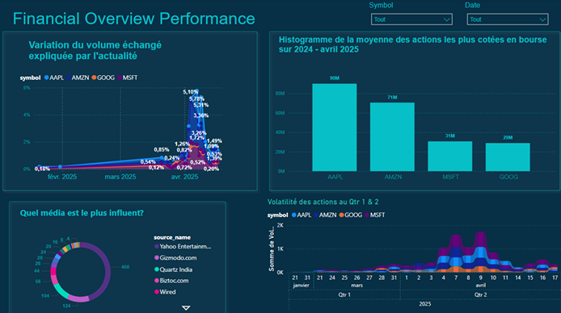


## 1. Introduction


In this project, we address a common challenge in companies: business data is scattered across many heterogeneous sources (REST APIs, SQL/NoSQL databases, CSV/JSON files), which makes it hard to exploit in a consistent way.
Our goal is to centralize both structured and unstructured data in an Azure Data Lake in order to enable near real-time analysis of stock market behaviour.

We focus on the relationship between economic/financial news and stock market movements for large companies such as Apple and Amazon.
More precisely, we aim to understand and explain stock price fluctuations by linking them to relevant news events.

**Project objectives:**

- Design an end‑to‑end pipeline for data ingestion, transformation and storage on Azure.
- Clean and structure the datasets to facilitate analytic queries.
- Visualize correlations between news and stock price variations in Power BI dashboards.
- Implement a scalable, monitored and cost‑optimized cloud solution.

You can find the detailed French report in `Rapport_Complet_Datalake.pdf` and explore the dashboards in the `dashboard_bourse_bdml1.pbix` file.

---

## 2. Data Sources

### 2.1 News data

We use two public REST APIs to collect financial and macro‑economic news for the period mid‑2024 to April 2025.

- **GNews API** – global news articles (mid‑2024 to early March 2025).  
  - Example endpoint:  
    `https://gnews.io/api/v4/search?q={searchTerm}&lang=en&country=us&from=2025-01-01&to=2025-04-30&max=100&apikey=****`  
  - Main fields extracted: `title`, `description`, `content`, `url`, `image`, `publishedAt`, `source_name`, `source_url`.

- **NewsAPI** – more recent articles (March–April 2025).
  - Example endpoint:  
    `https://newsapi.org/v2/everything?q={searchTerm}&from=2025-03-21T00:00:00&to=2025-04-21T23:59:59&language=en&sortBy=relevancy&apiKey=****`
  - Articles are returned under the `articles` field with similar attributes to GNews.

Keywords include ticker symbols and macro topics such as `AAPL`, `AMZN`, `MSFT`, `GOOG`, `Trump`, `Tariff`, `Market`.

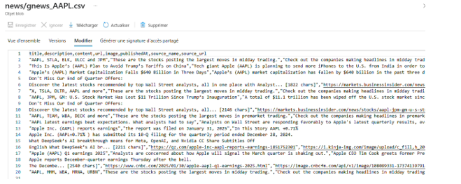


### 2.2 Financial market data

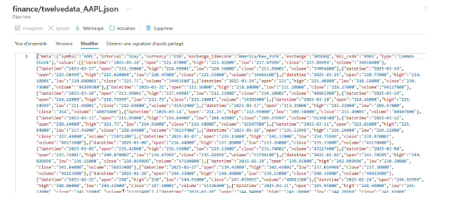

To describe stock market dynamics, we rely on the **Twelve Data** API.

- **Historical data (Jan 2024 – March 2025)** – JSON time series. 
  Example:  
  `https://api.twelvedata.com/time_series?symbol=AAPL&interval=1day&start_date=2024-01-01&end_date=2025-03-31&apikey=****`

- **Recent data (March–April 2025)** – exported and transformed directly to CSV due to Azure Data Factory memory limits.

Key columns:

| Column   | Description                                              |
|----------|----------------------------------------------------------|
| datetime | Trading date                                             |
| open     | Opening price                                            |
| high     | Maximum price of the day                                 |
| low      | Minimum price of the day                                 |
| close    | Closing price                                            |
| volume   | Number of shares traded                                  |
| symbol   | Stock ticker (AAPL, AMZN, MSFT, GOOG)                    |

All CSV and JSON files are later harmonized and stored as Parquet in the Data Lake.


---

## 3. Pipeline Architecture

The architecture is built on Microsoft Azure and automates the full lifecycle from ingestion to analytics.

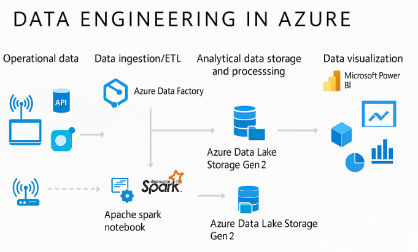

**Main services:**

- **Azure Data Factory (ADF):** orchestrates pipelines, calls REST APIs, and executes Mapping Data Flows for transformations.
- **Azure Data Lake Storage Gen2 (ADLS):** central storage with structured zones (`/raw`, `/cleaned`, `/curated`).  
- **Azure Synapse Analytics – Apache Spark notebooks:** used for heavy extractions and complex transformations on large JSON datasets.
- **Power BI:** connects directly to curated Parquet files to build interactive dashboards.
- **Parquet format:** column‑oriented storage optimized for analytics and joins.


### 3.1 Pipeline stages

1. **Ingestion**  
   - REST API calls to GNews, NewsAPI and Twelve Data using ADF and Synapse notebooks.
   - Raw files (CSV/JSON) stored under `/raw/news` and `/raw/finance` in ADLS Gen2.


2. **Cleaning & transformation**  
   - Standardization of schemas and data types (dates, numerics), removal of null/duplicate rows, enrichment with derived fields such as `symbol` and `datetime_ts`
   - Output written as Parquet in `/cleaned/news` and `/cleaned/finance`.
  
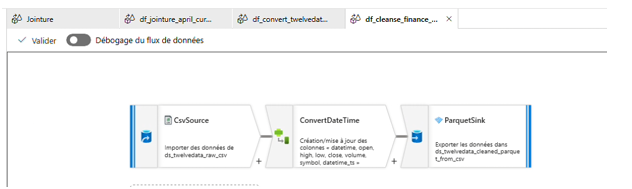
  
3. **Analytical join**  
   - Creation of a common `date_only` column from `publishedAt` and `datetime`.
   - Inner joins between news and market data using ADF Mapping Data Flows.
   - Consolidated Parquet views stored in `/curated` (e.g. `df_jointure_april_curated.parquet`).


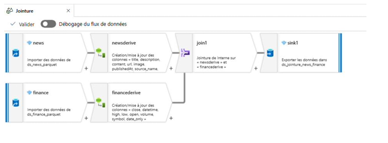

4. **Analytics & visualization**  
   - Power BI connects to the curated zone of the Data Lake and loads all Parquet files into a semantic model.
   - Interactive reports explore correlations between news events, price volatility and trading volumes.

---

## 4. Data Lake Organization

The Azure Data Lake is organized into three functional zones to manage the full data lifecycle.

- **Raw zone (`/raw`)**  
  - Contains unmodified data exactly as received from the APIs (CSV/JSON). 
  - Used as an immutable audit trail and for potential reprocessing.

- **Cleaned zone (`/cleaned`)**  
  - Stores standardized and quality‑checked datasets after initial transformations in ADF or Synapse.
  - Examples: `gnews_all_cleaned.parquet`, `finance_all_cleaned.parquet`.

- **Curated zone (`/curated`)**  
  - Holds business‑ready views and analytical datasets, including joins between news and market data. 
  - Used as the main source for Power BI and downstream analytics.
    
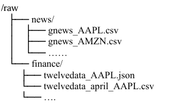

---

## 5. Ingestion Pipelines

### 5.1 REST linked services

Three linked services are configured in Azure Data Factory to call the APIs: one for GNews, one for NewsAPI, and one for Twelve Data.


### 5.2 Extraction pipelines

- **`PL_INGEST_GNEWS`**  
  - Uses a `ForEach` loop over the `keywords` list.
  - For each keyword, calls the GNews API and stores the result as a CSV file under `/raw/news`.

- **`PL_INGEST_API_NEWS`**  
  - Fetches the most recent articles from NewsAPI for each keyword and stores them as CSV files in `/raw/news`.

- **`PL_INGEST_TWELVEDATA` / `PL_INGEST_TWELVEDATA_APRIL` / `PL_INGEST_TWELVE_DATA_BOUCLE`**  
  - Retrieve historical and recent daily prices for each stock symbol.
  - JSON and CSV files are stored in `/raw/finance`.

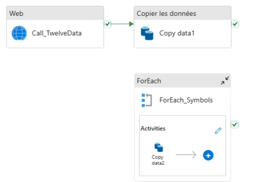

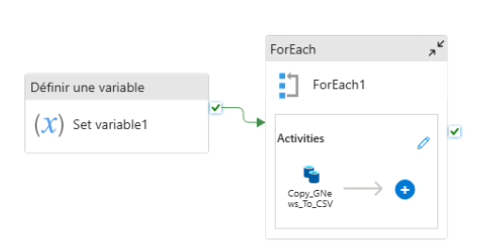

---

## 6. Data Transformation

### 6.1 Spark‑based cleaning (Synapse notebooks)

For large or complex datasets, we use Apache Spark notebooks in Synapse.

- Load multiple GNews CSV files and concatenate them.
- Filter rows with empty `content`, replace null `url` and `content` with `"N/A"`, and cast `publishedAt` to a timestamp.
- Write a single `gnews_all_cleaned.parquet` file to `/cleaned/news`.

For Twelve Data JSON:

- Extract `values[]`, cast numeric and datetime fields, and add the `symbol` from `meta.symbol`. 
- Merge all records into `finance_all_cleaned.parquet` under `/cleaned/finance`.

Due to Spark resource limits in the student subscription, April 2025 data had to be processed in ADF instead of notebooks.


### 6.2 ADF Mapping Data Flows

For lighter datasets and April 2025 extractions we use Mapping Data Flows in ADF.
Typical steps:

- Remove duplicated or null rows, especially on `content` and `datetime`.  
- Normalize date formats and standardize column names (`open`, `close`, `volume`, `symbol`, etc.).
- Add derived timestamp columns like `datetime_ts` and `publishedAt_ts`.  
- Convert CSV/JSON into Parquet for better performance.

Data Flows such as `df_cleanse_finance_csv`, `Cleanse`, and `df_convert_twelvedata_ts` are orchestrated by `Cleanse_Pipeline_Twelve` and `Cleanse_Pipeline_News`.

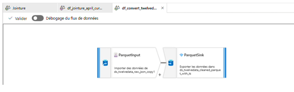


---

## 7. Analytical Join and Power BI

### 7.1 Joining news and market data

To study the relationship between events and price movements, we build analytical views by joining news and financial datasets on a common date.

- Derive `date_only` from `publishedAt` (news) and `datetime` (finance) using `toDate()`.
- Perform inner joins in ADF Data Flows (e.g. `df_jointure_april_curated`). 
- Store outputs as Parquet in `/curated` for long‑term analytics.

The result is a consolidated dataset where each row combines news attributes (title, source, content) with daily market indicators (open, close, high, low, volume, symbol) for the same date.


### 7.2 Power BI dashboards

Power BI connects directly to the curated Parquet files in Azure Data Lake Storage Gen2.

Main visuals include:

- **Daily traded volume by symbol (line chart).** Highlights peaks of activity that coincide with major news events.

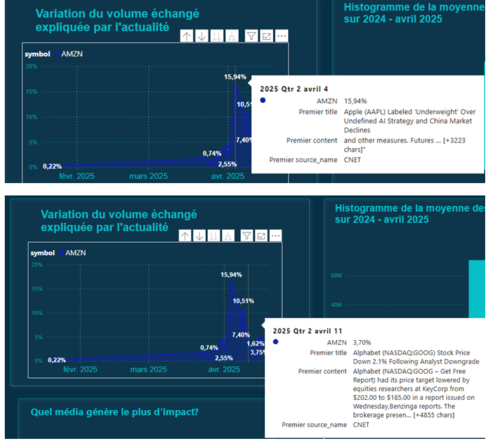

- **Average volume per stock (bar chart).** Shows that AAPL is the most heavily traded stock over the period.
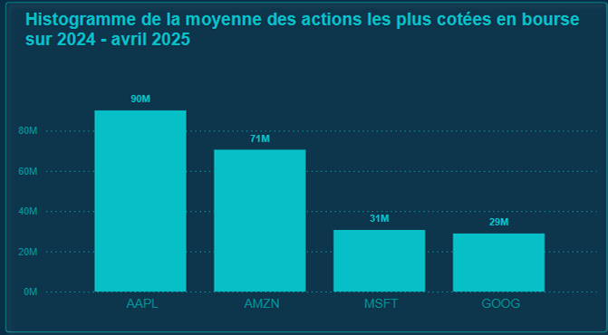

- **News source distribution (pie chart).** Identifies the most frequent media sources such as Gizmodo, Yahoo Finance, Wired and Quartz India.
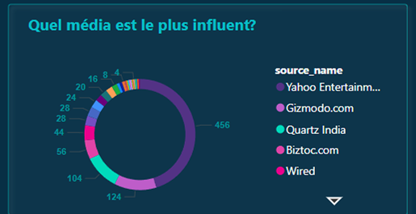

- **Volatility indicator (custom visual).** Volatility is computed as `high - low` for each day to spot the most unstable periods.

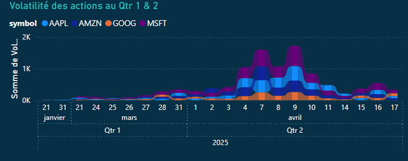

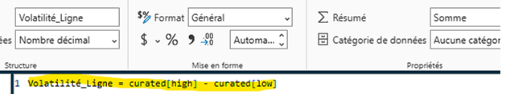

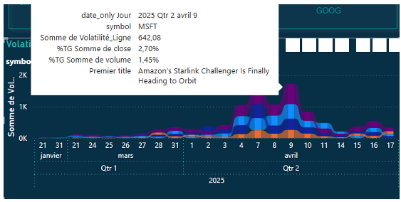

Interactive slicers on symbol and date make it possible to investigate specific episodes, for example the sharp reaction of AMZN or MSFT to tariff announcements or satellite‑launch news in April 2025.

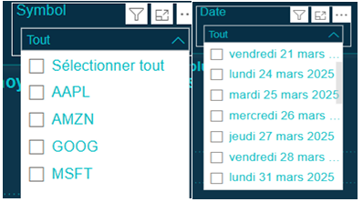

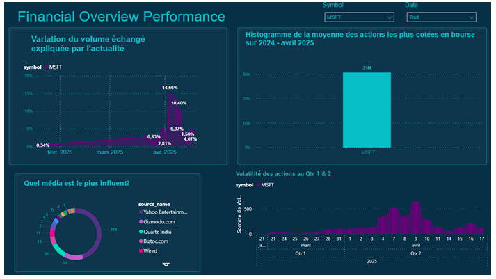


---

## 8. Security, Monitoring and Cost Management

Because the project runs on a student Azure subscription with a limited budget, strong focus was placed on cost control and data security.

- Spark pools in Synapse were configured with a small number of nodes and manually stopped after each job.
- Azure Cost Management was used to monitor the cost per service and identify the most expensive resources.
- All data is stored in secure ADLS Gen2 accounts with **IAM‑based access** control and no public endpoints.

The total cost remained under 100 €, with about 96 % of expenses coming from Synapse Analytics.

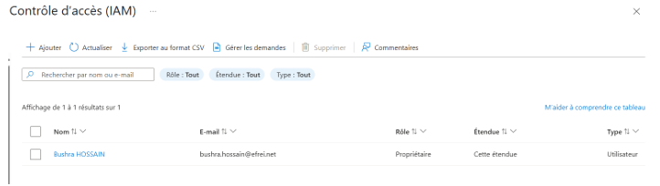


---

## 9. Challenges and Lessons Learned

Several technical limitations shaped the final design of the project.

- Spark jobs sometimes failed with `AVAILABLE_WORKSPACE_CAPACITY_EXCEEDED`, forcing us to move the joins from Synapse notebooks to ADF Data Flows.
- The automatic shutdown of the student subscription at a projected cost of 100 € temporarily blocked access to Synapse, ADF and the Data Lake.
- Lack of support for real‑time streaming (Kafka, live APIs) prevented us from implementing a full streaming architecture.

Despite these constraints, we successfully delivered a robust batch‑oriented pipeline and deepened our experience with Azure data engineering services.

---

## 10. How to run the project

1. Deploy the Azure resources (Data Lake Gen2, Data Factory, Synapse workspace) using the provided ARM templates or manual configuration.  
2. Configure the three REST linked services in ADF with your own API keys for GNews, NewsAPI and Twelve Data.  
3. Trigger ingestion pipelines to populate the `/raw` zone, then run the cleansing pipelines to fill `/cleaned` and `/curated`.  
4. Open the Power BI file `dashboard_bourse_bdml1.pbix`, update the Data Lake connection string, and refresh the model.

---

## 11. Repository structure

```text
.
├── Conteneur/                  # Export of the ADLS Gen2 container
├── Pipeline_Azure/             # ADF pipeline JSONs and Synapse notebooks
├── dashboard_bourse_bdml1.pbix # Power BI report
├── Rapport_Complet_Datalake.pdf# Full French report
└── README.md                   # This document
